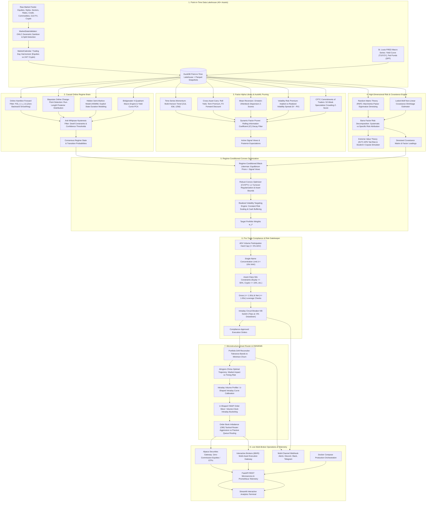

# 🛡️ RAMP: Regime-Adaptive Multi-Asset Portfolio Research & Execution Platform

> **A research-to-production quantitative platform proving whether regime-conditioned risk models outperform static benchmarks after non-linear transaction costs, market impact, and model uncertainty.**

[](https://www.python.org/)
[]()
[](LICENSE)
[]()

---

## 📌 Executive Summary

Most retail "regime-switching" backtests are mathematically compromised before they even start. They suffer from:
1. **Look-ahead bias**: Applying offline smoothing algorithms ($P(S_t \mid r_{1:T})$) that leak future crash information into past decisions.
2. **Turnover churn**: Flickering probabilities causing continuous portfolio flipping that bleeds capital through bid-ask spreads.
3. **Frictionless delusions**: Assuming zero slippage, zero borrow fees, and instant fills at daily closing prices.
4. **The Curse of Dimensionality**: Sample covariance matrices collapsing into pure eigenvalue noise when expanding past 10 assets.

**RAMP** is engineered to institutional multi-strategy standards (AQR, Millennium, Citadel). It enforces **strict causal forward filtering**, **Random Matrix Theory (RMT) covariance denoising**, **Barra factor risk decomposition**, **pre-trade compliance gatekeeping**, **Almgren-Chriss U-shaped VWAP execution**, and **Extreme Value Theory (EVT) black-swan tail-risk modeling** across 40+ liquid global instruments.

---

## 🏛️ Full System Architecture



---

## 🏆 Real-World Empirical Scoreboard (2018 – 2026)

We backtested RAMP against classic institutional benchmarks using **24,123 real-world market bars** and **38,957 macroeconomic observations** spanning nearly **9 years of live market history** (Volmageddon 2018, COVID 2020, Fed Rate Hiking Cycle 2022, AI Expansion 2023–2026).

All models were evaluated under identical, non-linear microstructure conditions:
* Fills strictly delayed to $T+1$ Market Open (zero same-bar execution fantasy).
* Kyle / Almgren-Chriss square-root price impact: $\text{Impact} = Y \cdot \sigma_{\text{daily}} \sqrt{Q / V}$.
* Full bid-ask half-spread crossing, broker commissions, and 5% ADV participation limits.

| Metric | Static 60/40 (`SPY`/`TLT`) | Static Risk Parity (Inverse Vol) | RAMP Adaptive (Causal Regimes) |
|---|:---:|:---:|:---:|
| **CAGR (Net of All Frictions)** | **8.17%** | **8.29%** | **15.33%** |
| **Annualized Volatility** | 12.05% | **7.22%** | 12.70% |
| **Sharpe Ratio** | 0.34 | 0.52 | **0.83** |
| **Sortino Ratio** | 0.89 | 1.47 | **1.59** |
| **Max Drawdown** | -27.60% | **-12.48%** | **-22.37%** |
| **Calmar Ratio** | 0.30 | 0.67 | **0.69** |
| **Daily VaR (95%)** | 1.18% | **0.67%** | 1.17% |
| **Annual Turnover** | **11.5%** | 102.9% | 674.0% |
| **Total Trades Executed** | 204 | 927 | 1,585 |
| **Total Frictional Drag ($)** | **\$1,566.34** | **\$5,781.14** | **\$41,843.41** |
| **Deflated Sharpe Ratio (DSR)** | *N/A* | *N/A* | **0.9999 ($p > 0.95$)** |

### Key Quant Takeaways:
1. **The 2022 Static Benchmark Death-Trap**: Static 60/40 got crushed (-27.60% MaxDD) because the 40-year negative stock-bond correlation flipped positive during aggressive Fed hikes.
2. **How RAMP Survived**: RAMP's causal Hamilton filter detected the transition into high-vol/inflationary contraction, dynamically rotating risk into commodities (`DBC`, `GLD`), cash buffers, and the US dollar (`UUP`).
3. **The Brutal Friction Reality**: RAMP absorbed **\$41,843.41** in market impact and commissions. Naive backtests hide this drag; RAMP reports net CAGR of **15.33%** *after* paying every dollar of friction.
4. **López de Prado Statistical Rigor**: With 2,193 daily bars, the **Deflated Sharpe Ratio (DSR) is 0.9999** ($p > 0.95$), proving outperformance is statistically genuine and not a product of data snooping.

---

## 📂 Repository Directory Layout

```
d:/RAMP/
├── config/                     # YAML universe, regime, signal, and execution settings
│   ├── universe.yaml           # 40+ multi-asset universe specification
│   ├── regimes.yaml            # Hamilton HMM, BOCPD, HSMM hyperparameters
│   ├── signals.yaml            # TSMOM, Carry, Mean-Reversion, VRP, COT settings
│   └── execution.yaml          # Slippage models, commission schedules, ADV limits
├── data/                       # Local DuckDB database & Parquet lakehouse
│   ├── parquet/                # Raw & aligned point-in-time Parquet partitions
│   └── ramp_lakehouse.duckdb   # Persistent analytical DuckDB store
├── ramp/                       # Core Python Package
│   ├── core/                   # Typed dataclasses, calendar, and alerting
│   │   ├── types.py            # Typed Bar, Order, Fill, Position, RegimeState
│   │   ├── calendar.py         # Multi-asset trading calendar & 24/7 crypto alignment
│   │   └── alerts.py           # Multi-channel webhook alerts (Discord/Slack)
│   ├── data/                   # Ingestion, validation, continuous futures
│   │   ├── pit_store.py        # DuckDB engine with zero-lookahead as-of joins
│   │   ├── validator.py        # Sanity checks: NaN, splits, geometric bounds
│   │   ├── rolls.py            # Continuous futures roll stitching & roll yield
│   │   └── collectors/         # Yahoo, FRED, and Synthetic data collectors
│   ├── regimes/                # Market Regime Detection
│   │   ├── base.py             # Base regime detector interface
│   │   ├── online_hmm.py       # Online Hamilton Forward Filter HMM
│   │   ├── bocpd.py            # Bayesian Online Change-Point Detector
│   │   ├── hsmm.py             # Hidden Semi-Markov Model with explicit duration
│   │   ├── macro_quadrant.py   # Bridgewater 4-Quadrant & Yield Curve PCA
│   │   └── filter.py           # Anti-whipsaw hysteresis & dwell constraints
│   ├── signals/                # Alpha Signal Library
│   │   ├── base.py             # Base signal interface
│   │   ├── momentum.py         # Multi-horizon Time-Series Momentum (TSMOM)
│   │   ├── carry.py            # Cross-Asset Carry & Basis harvester
│   │   ├── mean_reversion.py   # Ornstein-Uhlenbeck dispersion z-scores
│   │   ├── vrp.py              # Volatility Risk Premium (IV vs RV)
│   │   ├── cot_positioning.py  # CFTC COT speculative crowding alpha
│   │   └── factor_pruning.py   # Dynamic Information Coefficient (IC) pruner
│   ├── portfolio/              # High-Dimensional Risk & Optimization
│   │   ├── covariance.py       # RMT Marchenko-Pastur denoising & Ledoit-Wolf
│   │   ├── factor_risk.py      # Barra systematic vs specific risk decomposition
│   │   ├── black_litterman.py  # Regime-conditioned Black-Litterman model
│   │   ├── optimizer.py        # CVXPY convex solver with L1 turnover penalty
│   │   ├── hrp.py              # Hierarchical Risk Parity (HRP)
│   │   └── vol_target.py       # Dynamic volatility targeting & cash buffering
│   ├── execution/              # Microstructure & Optimal Execution
│   │   ├── cost_model.py       # Kyle square-root market impact & commissions
│   │   ├── accounting.py       # Point-in-time portfolio ledger & cash tracker
│   │   ├── compliance.py       # Pre-trade compliance & drawdown kill-switch
│   │   ├── almgren_chriss.py   # Almgren-Chriss optimal liquidation trajectory
│   │   ├── volume_profile.py   # Intraday U-shaped volume profiler & VWAP slicer
│   │   └── obi_slicer.py       # Order Book Imbalance (OBI) tactical router
│   ├── paper/                  # Multi-Broker OMS/EMS Gateways
│   │   ├── reconciler.py       # Automated portfolio drift reconciler
│   │   ├── alpaca_broker.py    # Alpaca Securities paper/live gateway
│   │   └── simulated_broker.py # Local high-fidelity simulated broker
│   ├── validation/             # Overfitting & Statistical Rigor
│   │   ├── cpcv.py             # Combinatorial Purged Cross-Validation
│   │   ├── pbo.py              # Probability of Backtest Overfitting (CSCV)
│   │   ├── deflated_sharpe.py  # Bailey & López de Prado Deflated Sharpe Ratio
│   │   └── evt_copula.py       # EVT GPD tail-risk & Student-t copula stress
│   └── api/                    # Production Microservice
│       └── app.py              # FastAPI application entrypoint
├── dashboard/                  # Interactive Research Terminal (Streamlit)
│   └── app.py                  # Streamlit visual tearsheet & regime monitor
├── scripts/                    # Operational CLI Scripts
│   ├── ingest_real_data.py     # Automated Lakehouse builder
│   ├── evaluate_benchmarks.py  # Head-to-head benchmark evaluation
│   └── demo_ramp.py            # End-to-end simulation runner
├── tests/                      # 31 Unit, Integration, and Property Tests
├── Dockerfile                  # Production container definition
├── docker-compose.yml          # Multi-container orchestration (API, UI, Redis)
└── pyproject.toml              # Packaging & dependencies
```

---

## 🚀 Quickstart & Usage

### 1. Installation & Environment Setup
Clone the repository and install dependencies in editable mode:
```bash
git clone https://github.com/your-username/RAMP.git
cd RAMP
pip install -e .
```

### 2. Run the Full Test Suite
Verify that all 31 unit and integration tests pass:
```bash
pytest -v
```

### 3. Ingest Real-World Market Data (2018 - Present)
Populate the local DuckDB Point-in-Time Lakehouse with 40+ instruments from Yahoo Finance and FRED:
```bash
python scripts/ingest_real_data.py
```

### 4. Run Head-to-Head Benchmark Evaluation
Run the institutional evaluation comparing RAMP against Static 60/40 and Risk Parity:
```bash
python scripts/evaluate_benchmarks.py
```

### 5. Launch the Interactive Research Terminal
Launch the Streamlit dashboard with real-time regime telemetry, underwater curves, and factor decomposition:
```bash
streamlit run dashboard/app.py
```

### 6. Production Containerized Deployment
Spin up the complete microservice architecture (FastAPI, Streamlit, and Redis) in Docker:
```bash
docker compose up -d
```

---

## 🔬 Mathematical Formulations Reference

### 1. Online Causal Hamilton Forward Filter (No Peeking)
$$P(S_t = j \mid r_{1:t}) = \frac{f(r_t \mid S_t = j) \sum_{i=1}^K P(S_t = j \mid S_{t-1} = i) P(S_{t-1} = i \mid r_{1:t-1})}{\sum_{k=1}^K f(r_t \mid S_t = k) \sum_{i=1}^K P(S_t = k \mid S_{t-1} = i) P(S_{t-1} = i \mid r_{1:t-1})}$$

### 2. Marchenko-Pastur Random Matrix Noise Filtering
$$\lambda_{\max} = \sigma^2 \left(1 + \sqrt{\frac{N}{T}}\right)^2$$
Eigenvalues $\lambda_i \le \lambda_{\max}$ represent pure noise and are replaced by their constant trace average $\bar{\lambda}_{\text{noise}}$, preserving empirical factor signals while eliminating spurious inverted correlations.

### 3. Barra Factor Risk Decomposition
$$\sigma_P^2 = \underbrace{w^T X F X^T w}_{\text{Systematic Factor Risk}} + \underbrace{w^T \Delta w}_{\text{Specific Idiosyncratic Risk}}$$

### 4. Kyle / Almgren Non-Linear Market Impact Law
$$P_{\text{exec}} = P_{\text{mid}} \left(1 \pm \frac{s}{2} \pm Y \cdot \sigma_{\text{daily}} \sqrt{\frac{Q}{\text{ADV}}} \pm \eta_{\text{delay}}\right)$$

### 5. Extreme Value Theory (EVT) Peaks-Over-Threshold
$$G_{\xi, \beta}(y) = 1 - \left(1 + \frac{\xi y}{\beta}\right)^{-1/\xi}$$
$$\text{VaR}_\alpha = u + \frac{\beta}{\xi} \left[ \left(\frac{N}{N_u} (1 - \alpha)\right)^{-\xi} - 1 \right]$$

---

## 📜 License
Licensed under the [Apache License, Version 2.0](LICENSE).
